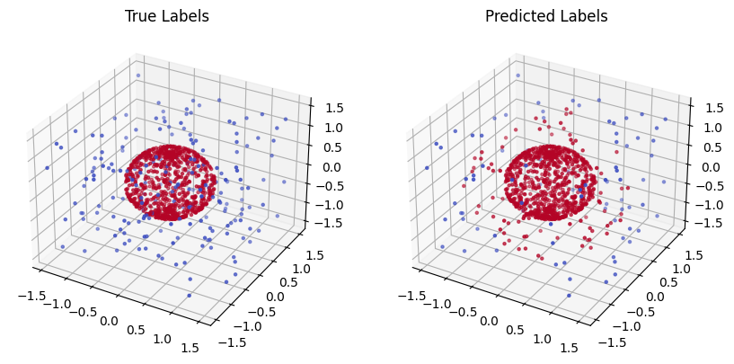
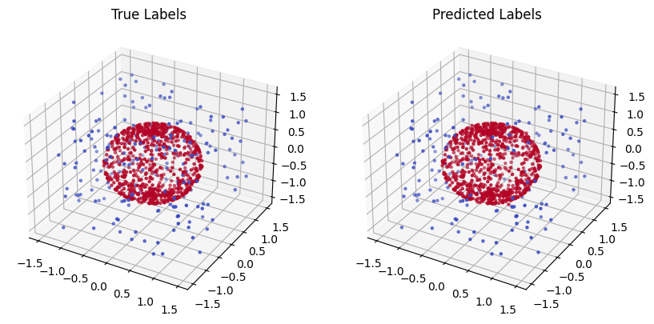

# pointnet-poc

Aucun relevé de mesures forestières n'est présent sur ce dépôt.

POC démontrant la pertinence de l'utilisation du modèle PointNet++ pour l'analyse de fichiers LIDAR en vue d'inventorer des zones forestières.

## Spheres

Le fichier [`spheres.ipynb`](./spheres.ipynb) est un Notebook Jupyter présentant démonstration simple de PointNet.
Il génère des nuages de points labellisés et bruités, entraîne le modèle, puis le teste.

