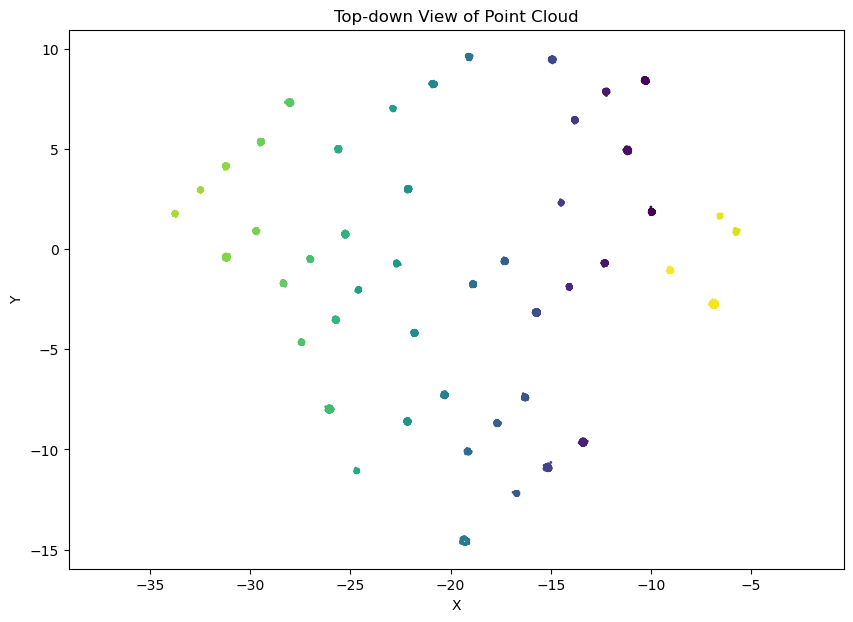

# pointnet-poc

Aucun relevé de mesures forestières n'est présent sur ce dépôt.

POC démontrant la pertinence de l'utilisation du modèle PointNet++ pour l'analyse de fichiers LIDAR en vue d'inventorer des zones forestières.

## DBSCAN

Le fichier [`spheres.ipynb`](./spheres.ipynb) est un Notebook Jupyter permettant, à partir de fichier `.las` 
représentant une coupe tomographique de 5cm d'une zone forestière, de grouper les points et supprimer les valeurs aberrantes afin
d'en extraire la forme des troncs.

## Spheres

Le fichier [`spheres.ipynb`](./spheres.ipynb) est un Notebook Jupyter présentant démonstration simple de PointNet.
Il génère des nuages de points labellisés et bruités, entraîne le modèle, puis le teste.

Après une génération : 

Après 15 générations : 

